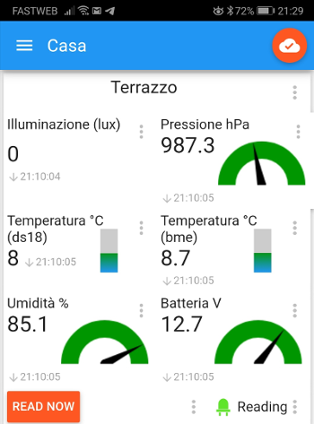
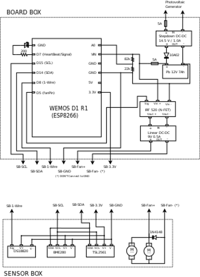

# arduinoenvmonitor
An environmental monitor based on Wemos D1

It is an environmental data monitor, based on a Wemos D1, powered by a photovoltaic panel via a backup battery, installed on the terrace, which provides the following data:
1) Brightness (TSL2561 - luxmeter)
2) Temperature (DS18B20)
3) Temperature, pressure, humidity (BME280)
4) Battery voltage
5) Atmospheric pression

The sensors are placed in a separate container, equipped with a transparent cover (for the brightness sensor) and a pair of push-pull fans which wash the internal air before reading data.

All collected data are sent via WiFi to an MQTT broker (PubSubClient library) in order to be used in a flexible and decoupled way.

## The idea

The whole project was created to explore some key technologies of the Arduino-like ecosystem that can be used to implement IoT devices.

The code is well modularized and contains a lot of good ideas and reusable frameworks/templates.

### Key technologies

- WiFi with ESP8266-based board
- Multitasking with Arduino-like boards
- Digital environment sensors: Bosch BME280 & Dallas DS18b20
- Digital luminosity  sensor: TSL2561
- MQTT protocol and MQTT Arduino library
- ESP8266-based board OTA update

### WiFi

Nothing special.

### Multitask

The code is written in order to perform repeated actions at specific time intervals and simultaneously react to commands from the network (via MQTT broker). The software doesn't use interrupts.

### Digital environment sensors

Two types of digital sensors have been used: Dallas DS18b20 and Bosch BME280. Both suffer of small self-heating problem. To improve their accuracy, the sensors are mounted into a separate box equipped with 2 fans in push-pull configuration which are activated for about 60-80 seconds before reading. The goal is to avoid accumulations of heat and/or humidity.

The Dallas sensor is a cheap temperature sensor available in TO92 package or Waterproof envelope; it has good performance, stability and precision. It communicates with the board using the 1-Wire protocol.

The Bosch BME280 is a multi sensor: temperature, humidity and atmospheric pression. Its best use is to control temperature, humidity and dew points in rooms; the three values are calculate and supplied in a coherent way, but they are not actually exact.  It communicates with the board using the I2C/SPI protocol.

### Digital luminosity sensor

TSL 2561 is a good and configurable digital light sensor; it supplies luminosity level in lux units. It has some problem when hit by a direct sunlight and communicates with the board using I2C/SPI protocol.
## MQTT protocol and MQTT Arduino library

MQTT is a very simple and reliable protocol, largely used for IoT devices communications. In this project it is used for "subscribe" and "publish" at the same time.

## MQTT Topics

It registers itself to the MQTT broker as *mqttClientId*

##### Published topics 

- *outsensorprefix*/light (luminosity level from TSL2561, in lux)
- *outsensorprefix*/tempbme (temperature from BOSCH BME280, in °C)
- *outsensorprefix*/humbme (hummidity from BOSCH BME280, in %)
- *outsensorprefix*/pressbme (pressure from BOSCH BME280, in hPa)
- *outsensorprefix*/bat (battery voltage, in V)
- *outsensorprefix*/tempdallas (temperature from Dallas DS18b20, in °C)
- *outsensorprefix*/reading (READINGON when starts reading sequence)
- announcement/clientid (for *mqttClientId*)

##### Subscribed topics 

- *mqttTopicCmds* (for receiving commands, like READNOW to start reading sequence)

##### Off-the-shelf MQTT client

There are a lot of Off-the-shelf MQTT clients available for Android and iOS. They can visualize subscribed topics and send messages to published topics.

I'm using this https://play.google.com/store/apps/details?id=snr.lab.iotmqttpanel.prod&hl=en

## Electric schema

## References

[https://tttapa.github.io/ESP8266/Chap07%20-%20Wi-Fi%20Connections.html](https://tttapa.github.io/ESP8266/Chap07 - Wi-Fi Connections.html)

https://www.electronicshub.org/arduino-multitasking-tutorial/

https://create.arduino.cc/projecthub/iotboys/how-to-use-ds18b20-water-proof-temperature-sensor-2adecc

https://lastminuteengineers.com/bme280-arduino-tutorial/

https://learn.adafruit.com/tsl2561

https://www.hivemq.com/blog/mqtt-essentials-wrap-up/

https://www.hivemq.com/blog/mqtt-client-library-encyclopedia-arduino-pubsubclient/

